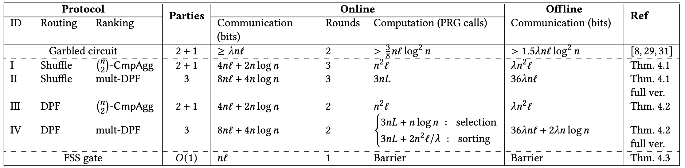
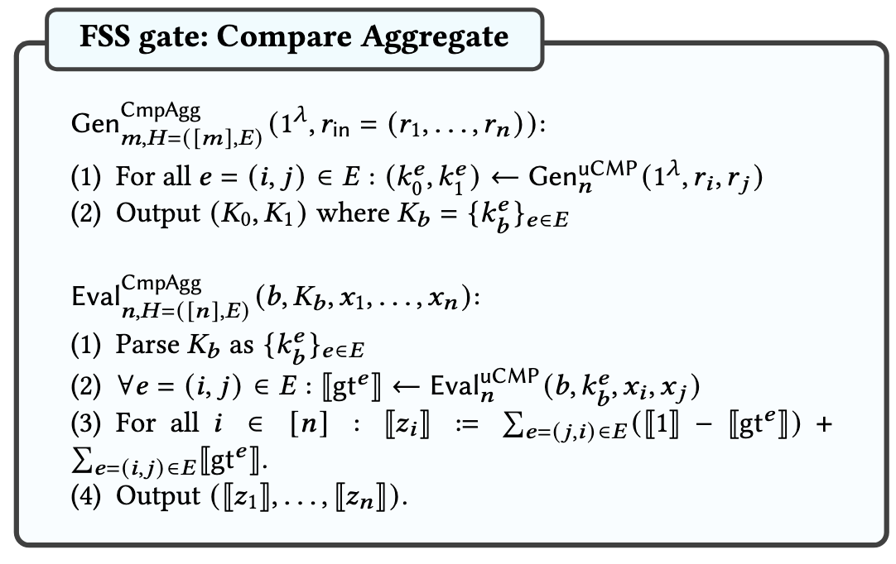
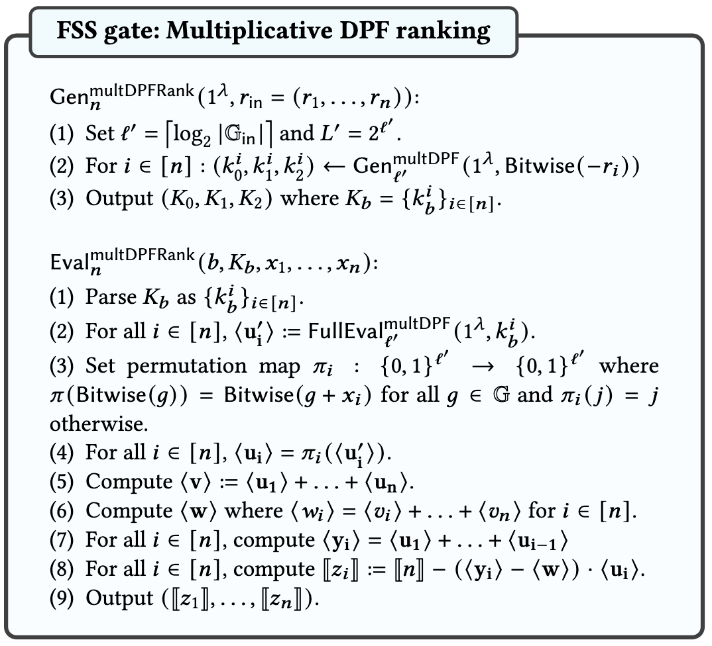
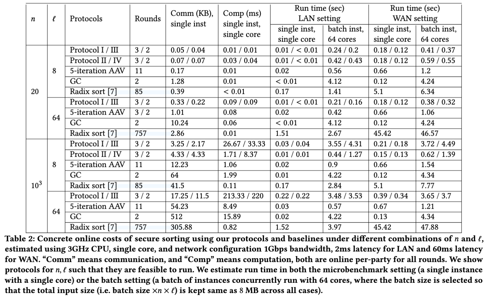

+++
date = '2025-01-05T16:47:41+08:00'
draft = false
math = true
title = '论文阅读|Secure Sorting and Selection via Function Secret Sharing'
tags = ["FSS", "Secure Sorting", "Secure Shuffle", "Secure Selection"]
categories = ["论文阅读"]

+++

## Background & Motivation

文章针对三方场景下的安全排序和安全选择问题，对于研究的问题，informal的描述如下：

* **安全排序：** 各个参与方持有一个secret shared的列表，这个列表中有$n$个元素（这些元素可能还有相关联的payload），他们最终得到secret shared的排序后的列表（以及对应的payload）
* **安全选择：** 依旧是上面这样设置的列表，参与方最终得到的是secret shared的第$k$个ranked element

在场景设置上，文章考虑了两种三方场景，一种是3-party，另一种是(2+1)-party。后面一个也是在基于FSS的方案中非常常见的场景，一个party会充当dealer，仅会在offline阶段给其他两个party发送一些correlated randomness来辅助online的计算。

对于各个参与方的输入，虽然总的参与方数量都是3个，但输入的列表都是在两方之间进行share的。

文章的**Motivation**是说，目前的方案要么通信复杂度非常高，要么轮复杂度非常高，远达不到optimal的程度，他们希望给出同时在online communication和round上达到near-optimal的方案。

## Their Idea

首先从明文下的排序算法出发，它可以分为两个阶段：Ranking和Routing。在Ranking阶段计算每个元素的Rank，其中Rank被定义为比该元素小$(<)$的元素数量；在Routing阶段，根据上一阶段计算得到的Rank对元素进行重排或选择（对应排序任务和选择任务）。因此，他们的idea就是通过安全地实现上面两个阶段，进行组合就可以得到安全排序协议或安全选择协议。

文章借助了FSS这一技术所提供的两个性质：

1. FSS的输出是线性的，可以在本地直接进行聚合；
2. 近年提出的一种新的FSS可以输出RSS形式的output，RSS可以在三方场景下无交互地进行一次乘法

在这样的想法下，文章针对Ranking和Routing给出了两种安全计算协议，他们之间可以组合从而形成安全排序和安全选择协议。因此本文的贡献可以罗列如下：

### FSS-based Ranking

文章基于DCF和DPF分别给出了一种安全Ranking的协议，这里简单介绍他们的idea是什么，具体的思考会放在后面。

#### DCF-based Ranking (CmpAgg)

Ranking是在计算每个元素$x$的Rank，因此只要将$x$与其他元素$y$两两进行比较，如果$y\leq x$，那么输出1的share，否则输出0的share，再将所有的share累加即可。而比较这个事情，在FSS中可以通过DCF来很容易地实现。

具体来说，给定一个列表$\{x_1, \dots, x_n\}$的share和列表$\{r_1, \dots, r_n\}$的share，参与方可以通过一轮交互来公开一个masked列表$\{x_1',\dots,x_n'\}$。之后，参与方使用DCF来对这个列表中的元素两两之间进行安全比较。对于元素$x_i$，$\textsf{Rank}(x_i)$为所有和$x_i$相关的两两比较的结果之和。注意到，DCF运行在两方场景下，需要一个dealer来分发密钥，因此该方案运行在(2+1)-party下。

#### DPF-based Ranking (mult-DPF)

对于给定的列表$\{x_1,\dots, x_n\}$的share，使用DPF可以给出该列表的histogram. 简单来说，对于元素$x$，构造$f_{r,1}$的DPF。该DPF可以产生一个unit vector $\boldsymbol{u}_r$，它在第$r$个位置上为1的share，其他位置上为0的share。参与方可以获得一个$x$的masked值$x'=x+r$，将$\boldsymbol{u}_{r}$左移$x'$即可得到$\boldsymbol{u}_x$. 对于每一个$x_i$都进行这样的操作，得到$\boldsymbol{u}_i$并进行累加得到$\boldsymbol{v}$，$\boldsymbol{v}$就是该列表的histogram.

有了histogram之后，对$\boldsymbol{v}$进行后缀加计算得到$\boldsymbol{w},$ 其中$w_i = \sum_{j=i}^n v_j$. 第$k$个位置的元素代表了$\geq k$的元素数量。因此，有
$$
\textsf{Rank}(x_i) = n - \boldsymbol{u}_i\cdot \boldsymbol{w}
$$
进一步的，我们想要实现stable的ranking，可以通过简单的修改完成。令$\boldsymbol{y}_i=\sum_{j=1}^{i-1}\boldsymbol{u}_i$，那么$\boldsymbol{y}_i\cdot \boldsymbol{u}_i$代表了$x_k=x_i$且$k<i$的$x_k$的数量。因此，stable rank可以表示为

$$
\textsf{Rank}(x_i) = n - (\boldsymbol{y}_i - \boldsymbol{w})\cdot \boldsymbol{u}_i
$$
注意到这里需要做一次inner product, 这在RSS的情况下是容易在本地直接做到的，因此可以使用multiplicative DPF来做。注意到，multiplicative DPF和RSS运行在3-party场景下，因此该方案也同样运行在3-party场景下。

> 这里感觉作者写的不对。$\textsf{Rank}(x_i)$应当是$n - (\boldsymbol{w}-\boldsymbol{y}_i)\cdot \boldsymbol{u}_i$，因为在$(\boldsymbol{w}-\boldsymbol{y}_i)\cdot\boldsymbol{u}_i$中，才会有第$k$个位置表示$x_k\geq x_i$且$k\geq i$的数量。而且我认为$(\boldsymbol{y}_i-\boldsymbol{w})$恒小于等于0，那么必然有$\textsf{Rank}(x_i)\geq n$，但这是不对的。

### Secure Routing

接下来需要根据Rank对数据做Route，这里有两个思路：一种是安全地把Rank给公开了，这可以依赖安全shuffle，在做Rank之前把列表给shuffle了，那么即使公开Rank也没问题了；一种是安全地做Route，文章作者也就这一思路提出了一种基于DPF的方法。这里我们就只介绍后一种。

#### Secure Routing via standard DPF

Route实际上是把Rank为$k$的元素放到第$k$个位置上。假设Route后的列表记为$\boldsymbol{y}$，原列表记为$\boldsymbol{x}$，那么有$y_i=\boldsymbol{u}\cdot\boldsymbol{x}$，其中$\boldsymbol{u}$是一个unit vector，对于$\textsf{Rank}(x_k)=i$，$u_k = 1$，对于其他位置，$u_k=0$. 那么，对于unit vector我们可以用DPF来实现。参与方首先公开一个经过masked的Rank值列表$\hat{\boldsymbol{y}}$，其中$\hat{y}_i=\textsf{Rank}(x_i)+r_i$. 然后对$k\in[n]$，对$\hat{y}_i-k$做DPF求值。该DPF针对$f_{r_i, 1}$，那么如果$\textsf{Rank}(x_i)=k$，求值得到1的share，否则得到0的share。之后将结果和$\boldsymbol{x}$做乘法即可。

## Detailed Construction

有了上面的idea之后，构造对应的FSS Gate都是一些比较直观的事情，这边直接放出构造。

* Compare Aggragate ($\textsf{CmpAgg}$)

* Multiplicative DPF ranking ($\textsf{multDPFRank}$)

## 测试

## Discussion

从运行时间上来看，实际上作者给出的方案在大数据量场景下表现的并不是很好，还是有很大的改进空间的。作者的更大的贡献应该是提出的Compare-Aggregate (CA) Model，但这块我目前缺少一些算法知识，还没看懂。

* TODO: 下面会想做一些更细致的讨论，包括复杂度分析、运行时间分析等等，但作者似乎还没放出完整版，很多细节在会议版中都没有提到，因此暂时搁置。

### 复杂度分析
